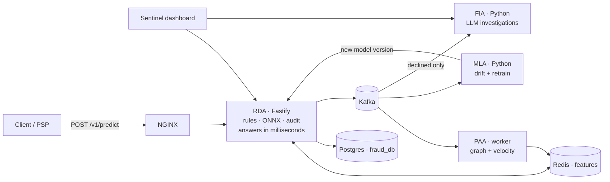

# Ojuri

[](https://github.com/ojuri-io/ojuri/actions/workflows/ci.yml)
[](LICENSE)

> Open source fraud detection that bears witness to every transaction.

Ojuri decides whether a payment is fraud, in the moment it happens. Send
it a transaction, get back a decision — accept, review, or decline —
along with the reasons behind it.

It runs entirely on your own servers. Your transaction data never leaves
your infrastructure, there is no SaaS account, and there are no per-call
fees. You start it with one `docker compose up`.

**How well does it work?** We ship a 128,000-transaction simulation you
can run yourself. An untrained install flags 34% of the fraud in it. After
one round of learning from labelled data, that rises to 98.8%, while
wrongly flagging 1.1% of legitimate payments. "Flags" means declined
outright or sent to a human for review. Those figures need two settings
changed from their defaults —
[`docs/FRAUD_SIMULATION.md`](docs/FRAUD_SIMULATION.md) has the exact
configuration and the commands to reproduce it.

The name is Yoruba (*ojúrí*) for *the seeing eye* — what a witness brings
to a transaction. That's also the system's job: observe what happens,
attest to what's true, and give analysts the evidence they need to decide.

## How it fits together

Four services split the work. **RDA** answers your API call in
milliseconds — it is the only part your payment flow waits on. The other
three work in the background off a Kafka queue: **PAA** builds the
behavioural picture (who pays whom, how often), **MLA** watches for the
model going stale and retrains it, and **FIA** writes an investigation
report for anything that got declined.

If PAA, MLA, or FIA goes down, payments keep being scored. Only RDA is on
the critical path.

You can run as many copies of RDA as you need. **PAA is the exception —
run exactly one.** It holds the payment network in memory, so a second
copy would see only half the picture and quietly stop spotting fraud rings
that span both. See [`paa-service/`](paa-service/) for the detail.



---

## Try it in 5 minutes

All you need is **Docker 20.10 or newer, with Compose 2.24 or newer**
(`docker compose version` will tell you). On older Compose, use the
build-from-source steps further down instead.

```bash
git clone --depth 1 --branch v1.4.0 https://github.com/ojuri-io/ojuri.git
cd ojuri
cp .env.example .env                        # required — sets your JWT secret and DB password
docker compose -f docker-compose.yml -f docker-compose.ghcr.yml up -d
docker compose logs db-migrate              # your admin password is printed here, once
```

That starts Postgres, Redis, Kafka with Zookeeper, three copies of RDA
behind NGINX (change the count with `RDA_REPLICAS`), the PAA worker, and
Prometheus with Grafana. A one-off `db-migrate` container sets up the
database first, then exits. MLA and FIA are not started — they're opt-in.

Now score a transaction:

```bash
curl -X POST http://localhost/v1/predict \
  -H "Content-Type: application/json" \
  -d '{
    "transaction_id": "550e8400-e29b-41d4-a716-446655440000",
    "sender_id": "user_a",
    "receiver_id": "user_b",
    "amount": 300.00,
    "transaction_type": "TRANSFER",
    "timestamp": 1717718400000,
    "is_authenticated": true,
    "device_is_trusted": true,
    "account_age_days": 900
  }'
```

You get back a decision and the reasons for it:

```json
{
  "transaction_id": "550e8400-…",
  "fraud": false,
  "fraud_probability": 0.0271,
  "decision": "ACCEPT",
  "decision_source": "ML",
  "reason_codes": [
    { "code": "PAGERANK",        "description": "Network-centrality score from the transaction graph", "contribution": -0.20, "value": 0.3509, "basis": "HEURISTIC" },
    { "code": "CLUSTERING_COEF", "description": "How tightly the sender clusters with known peers",    "contribution": 0.1142, "value": 0, "basis": "HEURISTIC" }
  ],
  "model_version": "default",
  "threshold": 0.3,
  "audit_id": "d9686470-…",
  "latency_ms": 9,
  "timestamp": 1786293849415
}
```

Your numbers will differ — the probability and reason codes depend on what
the system has seen so far, and `latency_ms` depends on your hardware and
what else it's doing. The `threshold` is `0.3` because this is a
`TRANSFER`; each transaction type has its own bar.

**Running it a second time returns `409`.** Each `transaction_id` can only
be scored once, so change it before you try again. That's deliberate: it
means a retry after a network timeout can't double-charge your fraud
stats.

Only six fields are required. There are about 40 more you can send —
device, location, identity, agent, recipient — and the more you send, the
better the prediction. They're all listed in
[`docs/PREDICT-API.md`](docs/PREDICT-API.md).

**What next?** [Open the dashboard](#open-the-dashboard) ·
[Fill it with demo data](#load-some-demo-data) ·
[Train it on your own data](#train-it-on-your-own-data)

<details>
<summary><b>Two things that surprise people on a fresh install</b> — both are normal</summary>

**The response says `"model_version": "default"`.** That's the real name
of a real registered model — the demo one, which the database seed
registers as ACTIVE for you. It's called "default" on purpose, so the
response always tells you plainly that you're still on the shipped model.
It changes to `v1.x` once you train and activate your own.

**A request with no context fields might come back `DECLINE`.** With no
device, location or history to go on, and an empty feature cache, the demo
model treats the blank profile as risky. Send the context fields shown
above, or send more traffic so PAA can learn what normal looks like.

Other symptoms are explained in
[`docs/TROUBLESHOOTING.md`](docs/TROUBLESHOOTING.md).
</details>

<details>
<summary><b>Building from source, running on Windows, or checking system requirements</b></summary>

**Build from source** — do this if you're contributing, or if your Docker
Compose is older than 2.24:

```bash
git clone https://github.com/ojuri-io/ojuri.git
cd ojuri && cp .env.example .env
docker compose up -d --build       # first build takes a few minutes
```

**On Windows**, follow [`docs/WINDOWS-SETUP.md`](docs/WINDOWS-SETUP.md)
instead. It covers the installer, the `py -3.11` command, the Microsoft
C++ redistributable that XGBoost needs, and the cmd/PowerShell syntax.

**Ports** — these need to be free on your machine: `80 3000 3001 5173
5433 6380 9090 9091 9093 9094 29092`. Postgres uses `5433` rather than
the usual `5432` so it won't clash with one you already have.

**Node 20+** is only needed if you want to run the dashboard or do
host-side development.

**Python 3.11 exactly** is only needed to run MLA or FIA outside Docker.
Other 3.x versions won't work — MLA depends on specific ONNX library
versions that don't build elsewhere.

**FIA needs room**: about 10 GB of disk for the language model weights and
at least 16 GB of free RAM. That's why it's opt-in rather than on by
default — start it with `docker compose --profile fia up -d`.
</details>

---

## What you get

**Your data stays yours.** Every service is a container you run. Nothing
is sent to us or anyone else. That makes data-residency rules like GDPR,
NDPR and CBN much simpler to satisfy. MIT licensed, no per-call fees.

**Every decision comes with reasons.** The response tells you which
signals drove it — the amount, how fast the account is moving, how the
sender sits in the payment network. You don't need a second API call to
find out why. → [Reason codes](docs/REASON-CODES.md)

**Declined payments get investigated automatically.** Anything Ojuri
blocks is handed to FIA, which runs a language model on your own hardware
and writes up a case: what it thinks happened, what to do about it, and
which signals it relied on. This happens after the fact, so it never slows
a payment down. → [FIA API](docs/FIA-API.md)

**The model looks after itself.** Ojuri tracks whether its predictions are
drifting away from reality, retrains when they are, and checks the new
model is genuinely better before promoting it. You can also run a
candidate model against real past decisions to see how it would have
behaved. → [Model registry](docs/MODEL-REGISTRY.md)

**It degrades instead of breaking.** If Redis is unreachable, predictions
still go out using default values. If the model times out, the transaction
goes to a human for review — a customer never gets declined because of an
infrastructure problem.

**A dashboard comes with it.** Sentinel gives your fraud team live
decisions, a review queue, a rule editor, the model registry, the audit
log, FIA's investigations, and user admin. When a reviewer overturns a
decision, that correction feeds back into training — so the model learns
from your analysts, not from its own past guesses.

---

## Where to go next

**Just evaluating?** [Load the demo data](#load-some-demo-data) so the
dashboard has something to show, then run the
[fraud simulation](docs/FRAUD_SIMULATION.md) to see how well it detects
fraud on your own hardware.

**Rolling it out?** Read [Connecting your system](#connecting-your-system)
for the API and authentication, then [Running it](#running-it) for
upgrades and the dashboard, then
[Train it on your own data](#train-it-on-your-own-data).

**Contributing?** [`CONTRIBUTING.md`](CONTRIBUTING.md) has the development
setup. [`docs/ARCHITECTURE.md`](docs/ARCHITECTURE.md) explains what each
service is responsible for.

---

## Connecting your system

Your application calls `POST /v1/predict` and acts on the `decision` it
gets back — `ACCEPT`, `REVIEW`, or `DECLINE`. Everything below is
optional.

- **The full API** — every field you can send, what comes back, and every
  error case: [`docs/PREDICT-API.md`](docs/PREDICT-API.md). You choose the
  `transaction_id`, so use whatever reference your system already has.
- **Locking down the API** — set `RDA_REQUIRE_API_KEY=true`, then issue
  keys from `POST /v1/admin/api-keys`: [`docs/AUTH.md`](docs/AUTH.md).
  People logging into the dashboard use accounts and roles instead:
  [`docs/AUTHZ.md`](docs/AUTHZ.md).
- **Safe retries** — if a request times out and you send it again, an
  `Idempotency-Key` header stops it being scored twice:
  [`docs/IDEMPOTENCY.md`](docs/IDEMPOTENCY.md).
- **Being notified** — Ojuri can push decisions to your endpoint, signed
  and retried: [`docs/WEBHOOKS.md`](docs/WEBHOOKS.md).
- **Adding your own rules** — write rules that run before the model (and
  can skip it) or after it (and can overrule it). They update within 30
  seconds, no restart: [`docs/RULES.md`](docs/RULES.md).
- **Adding your own signals** — the model reads 64 features out of the
  box; you can define more without writing code:
  [`docs/FEATURES.md`](docs/FEATURES.md).

---

## Running it

### Open the dashboard

The dashboard runs separately from the backend. If your backend is in
Docker, tell the dashboard to talk to NGINX first — otherwise it looks for
a local RDA on port 3000 and login fails with a 502:

```bash
cd frontend
npm install
cp .env.example .env       # already set up for the Docker stack
npm run dev                # http://localhost:5173
```

If instead you're running RDA directly on your machine with `npm run
start:dev`, open `frontend/.env` and switch to the second block — the
`127.0.0.1` one.

Log in with the admin password from `docker compose logs db-migrate`.
You'll be asked to change it immediately. If you've already lost it — it's
only printed once — run `npm run reset:admin` for a new one. More detail:
[`docs/FRONTEND.md`](docs/FRONTEND.md).

### Load some demo data

A new install has an empty dashboard until transactions start flowing.
This seeder sends about 500 realistic ones, including a ring of accounts
cycling money between themselves, a mule network, VPN sessions, and
payments deliberately split to stay under reporting limits:

```bash
docker compose --profile demo run --rm demo-seed          # inside the stack
RDA_URL=http://localhost node scripts/demo-traffic.mjs    # or from your machine
```

Set `RDA_URL` to wherever RDA is reachable. For the Docker stack that's
`http://localhost`, because NGINX answers on port 80 — the stack does not
publish port 3000 to your machine. Use `http://localhost:3000` only if
you're running RDA directly with `npm run start:dev`.

The demo comes with its own rule pack, which is **switched off by
default** — its thresholds are tuned for the demo data and would flag far
too much real traffic. Turn it on to see the intended mix of decisions:
set `SEED_DEMO_RULES_ACTIVE=true` before your first `docker compose up`,
or toggle the four `demo:` rules in Sentinel → Rules.

### Upgrading and version pinning

All five services are released together under one version number, and the
images live at `ghcr.io/ojuri-io/{rda,paa,mla,fia,sentinel}`. By default
you track `v1`, which picks up new features and fixes but never a breaking
change. To upgrade:

```bash
git pull --tags
docker compose -f docker-compose.yml -f docker-compose.ghcr.yml pull
docker compose -f docker-compose.yml -f docker-compose.ghcr.yml up -d
```

If you're in a regulated environment and need to know exactly what you're
running, set `OJURI_VERSION` to a specific release before any compose
command. You then upgrade deliberately, by changing that value:

```bash
export OJURI_VERSION=v1.4.2
```

Check [`CHANGELOG.md`](CHANGELOG.md) before upgrading — it flags new
settings worth reviewing. Major version jumps need
[`UPGRADING.md`](UPGRADING.md). The full policy is in
[`VERSIONING.md`](VERSIONING.md). To hear about new releases, use **Watch
→ Custom → Releases** on the repo; security advisories go out the same
way.

### When something looks wrong

[`docs/TROUBLESHOOTING.md`](docs/TROUBLESHOOTING.md) explains the symptoms
people hit most: a 502 when logging into the dashboard, a rule firing when
you expected the model, MLA saying it can't find a model, and the two
ways benchmarks quietly produce numbers that are too good to be true.

---

## Train it on your own data

Ojuri ships with a small pre-trained model so `/v1/predict` gives you real
answers from the first minute. It was trained on public data, not yours —
replace it once you have your own transaction history.

MLA does the training. You can run it inside Docker with `--profile mla`,
or in a local Python environment, which is the better choice if you want
to use a GPU:

```bash
cd mla-service
python3.11 -m venv venv         # whichever command gives you 3.11 — see below
source venv/bin/activate
python --version                # should now say 3.11.x
pip install -r requirements.txt
python scripts/train_initial_model.py   # trains a first model
python -m src.main                      # then watch for drift and retrain
```

It has to be 3.11 — MLA depends on ONNX libraries that don't build on
other versions. Depending on how you installed it, the command might be
`python3.11`, `python3`, or a pyenv shim; use whichever one reports
`3.11.x`. Once the venv is active, plain `python` is the right command.

Once trained, activate the new model from the dashboard, or copy the
`.onnx` file to `models/fraud_model.onnx` and RDA will pick it up.

To train on your real data — loading it, training, registering the result,
and switching to it — follow [`docs/TRAINING.md`](docs/TRAINING.md).
If you're importing transaction history from a CSV, start with
[`docs/ADOPTER_TRAINING.md`](docs/ADOPTER_TRAINING.md).

Every time a model loads, Ojuri tests it: it scores the same input twice
to check the answers match, then checks it can still tell an obviously
legitimate payment from an obviously fraudulent one. If either test fails,
`/readyz` reports the model as DOWN, so your load balancer or orchestrator
can take that instance out of rotation. And if inference can't run at all,
the transaction goes to a human for review rather than being scored on a
guess.

---

## Architecture

RDA handles the request. It runs your pre-model rules, looks up the
sender's behavioural features in Redis, scores the transaction with the
model, applies your post-model rules, writes an audit record, and puts the
event on Kafka.

From there, PAA picks it up and updates its picture of who pays whom and
how often, writing that back to Redis so the next prediction is better
informed. MLA reads the same stream to watch for the model going stale.
Declined transactions also go onto a second queue that only FIA reads —
that keeps slow language-model work well away from the fast path.

For per-service detail, data-flow diagrams, and deployment topology, see
[`docs/ARCHITECTURE.md`](docs/ARCHITECTURE.md).

### How fast is it?

Scoring itself is very fast — 49 microseconds at the 99th percentile. A
full `POST /v1/predict` is 6 ms at the 99th percentile when nothing else
is running, measured against a single instance directly rather than
through NGINX. With 16 clients at once it holds around 516 requests per
second, with a 99th percentile of 85 ms.

**Treat these as rough orientation, not promises.** They were measured on
one Apple Silicon laptop. Measure on your own hardware — and read the
benchmarking notes in
[`docs/ARCHITECTURE.md`](docs/ARCHITECTURE.md#8-performance-characteristics)
first, because two of our own defaults (the NGINX rate limit and the
duplicate-request shortcut) will hand you impressively fast numbers that
mean nothing.

---

## Documentation

**Connecting your system** — [Predict API](docs/PREDICT-API.md) ·
[API keys](docs/AUTH.md) · [Users and roles](docs/AUTHZ.md) ·
[Safe retries](docs/IDEMPOTENCY.md) · [Webhooks](docs/WEBHOOKS.md) ·
[Rules](docs/RULES.md) · [Features](docs/FEATURES.md) ·
[FIA API](docs/FIA-API.md)

**Running it** — [Architecture](docs/ARCHITECTURE.md) ·
[Troubleshooting](docs/TROUBLESHOOTING.md) ·
[Dashboard](docs/FRONTEND.md) · [Audit log](docs/AUDIT.md) ·
[Reason codes](docs/REASON-CODES.md) ·
[Model registry](docs/MODEL-REGISTRY.md) ·
[Windows setup](docs/WINDOWS-SETUP.md)

**Training models** — [Training](docs/TRAINING.md) ·
[Importing your data](docs/ADOPTER_TRAINING.md) ·
[Fraud simulation](docs/FRAUD_SIMULATION.md)

**About the project** — [Roadmap](ROADMAP.md) ·
[Changelog](CHANGELOG.md) · [Versioning](VERSIONING.md) ·
[Upgrading](UPGRADING.md) · [Security](SECURITY.md) ·
[Contributing](CONTRIBUTING.md)

Everything, indexed: [`docs/README.md`](docs/README.md). Each service also
has its own README: [`paa-service/`](paa-service/) ·
[`mla-service/`](mla-service/README.md) ·
[`fia-service/`](fia-service/README.md) ·
[`frontend/`](frontend/README.md)

---

## Status

**Stable as of v1.4.0.** API keys, user accounts and roles, live-editable
rules, the model registry with per-segment thresholds, a full audit log
with reasons on every decision, signed webhooks, safe retries, FIA's
on-demand reports and follow-up questions, and the Sentinel dashboard.

The learning loop is closed: you send chargebacks and confirmed fraud back
in through `POST /v1/admin/labels`, Ojuri retrains once enough have
arrived, tests the new model against a later time period than it trained
on, and only ships it if it genuinely wins. A new model can also run
silently alongside the live one so you can compare them on real traffic
before switching.

One caveat on the 98.8% figure above: it was measured with the demo rules
switched off and the review band set to 0.08. A fresh install sets that
band to 0, which means nothing is ever sent for review. Match the
configuration in [`docs/FRAUD_SIMULATION.md`](docs/FRAUD_SIMULATION.md)
before comparing your own numbers.

**Planned next** (see [`ROADMAP.md`](ROADMAP.md)): a Helm chart and
Terraform module, TypeScript and Python client libraries, canary rollouts
by API-key group, PII tokenisation, mTLS between services, OAuth 2.0,
ready-made Stripe/Adyen/Plaid connectors, and a hosted sandbox.

---

## License

MIT — see [`LICENSE`](LICENSE).

---

*Ojuri (Yoruba: ojúrí) — "the seeing eye." A witness to every transaction.*
