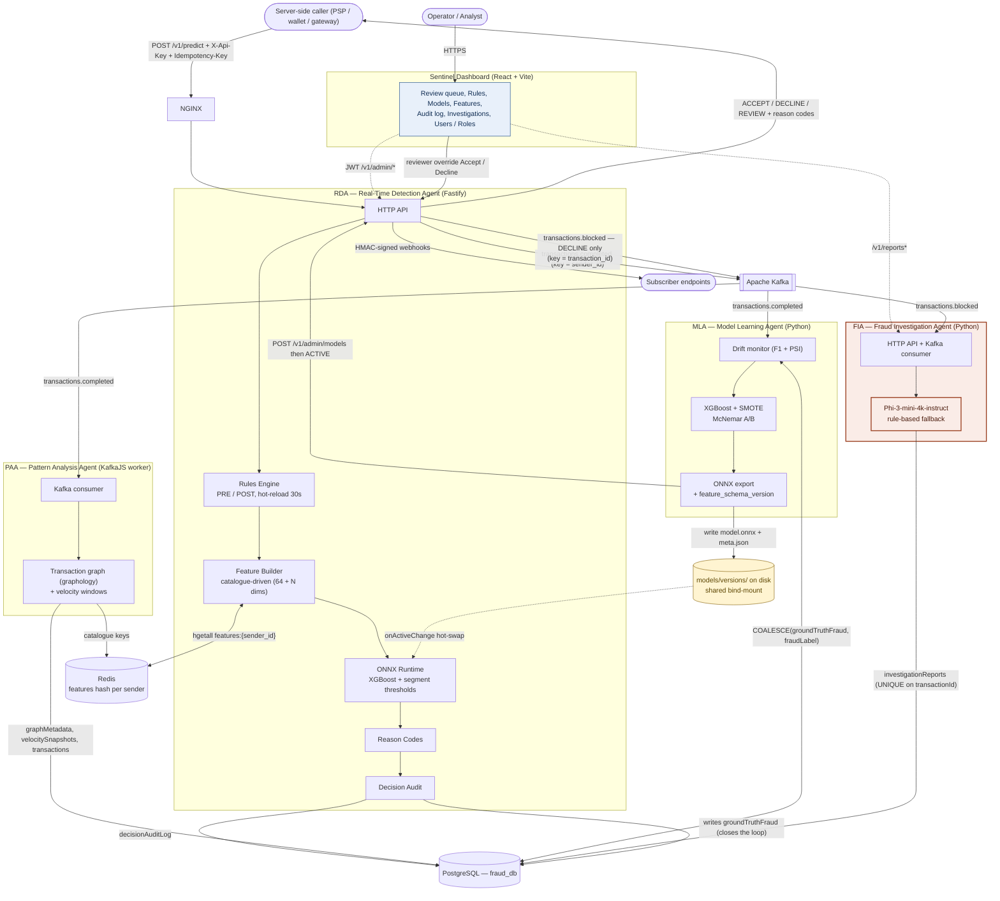
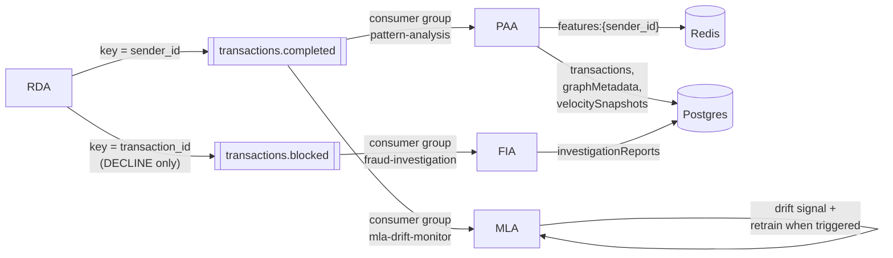
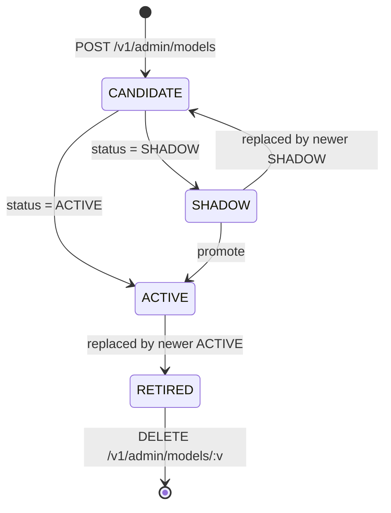
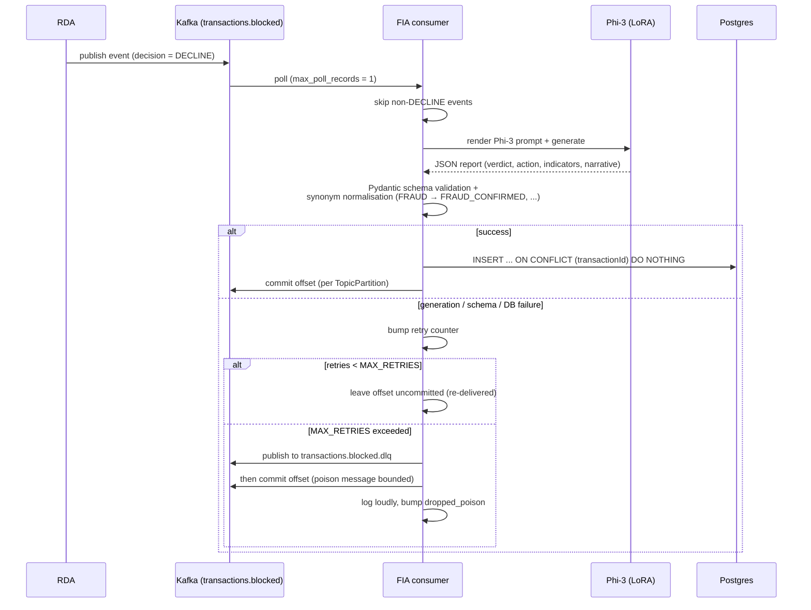

# Architecture

This is the technical reference for how Ojuri is put together: what each
service does, how data moves between them, and what happens when things
break.

Individual contracts — auth, rules, the model registry, features, audit,
reason codes, webhooks, idempotency, the FIA API, the frontend — each have
their own document under `docs/`, linked from the relevant section rather
than repeated here.

## 1. Overview

Ojuri is four backend services and a dashboard, sharing PostgreSQL, Redis
and Kafka.

The split exists to protect one thing: the few milliseconds you have to
approve or decline a payment. **RDA** (TypeScript / Fastify) owns that
budget and does nothing else. Everything expensive happens somewhere
else, after the fact:

| Service | Language | Does |
|---|---|---|
| **RDA** | TypeScript / Fastify | Decides. The only service on the authorization path. |
| **PAA** | TypeScript / KafkaJS | Builds the behavioural picture — who pays whom, how often. |
| **MLA** | Python | Watches for the model going stale and retrains it. |
| **FIA** | Python | Writes an investigation report for each declined payment. |
| **Sentinel** | React + Vite | Operator dashboard. Admin reads and occasional writes only. |

One Postgres database, `fraud_db`, backs all of them. RDA owns the schema
through its Knex migrations in `src/database/migrations/`; the other
services read and write the same tables but never migrate them. Schema
changes go through the root.

## 2. System diagram



Two port notes: Postgres is on host **5433** and Redis on **6380** (rather
than 5432 and 6379) so they don't collide with servers you already have
installed.

The two Kafka topics are partitioned on different keys, deliberately.
`transactions.completed` is keyed by **`sender_id`**, so one user's events
always arrive at PAA in order. `transactions.blocked` is keyed by
**`transaction_id`**, so a single attacking sender can't pin all of FIA's
work onto one partition.

## 3. Design principles

**1. Only RDA can affect a payment.** Everything else is asynchronous. If
PAA, MLA, FIA or the dashboard is down, payments keep being scored.

**2. Two topics, not one.** Every decision goes to
`transactions.completed`. Declines go to `transactions.blocked` as well.
The second topic exists so FIA — which takes seconds per report — can
never sit in the same queue as PAA, which works in milliseconds.

**3. Degrade, don't fail.** Redis and ONNX both sit behind `opossum`
circuit breakers, and they degrade differently on purpose:

- *Redis unavailable* → carry on with population-default features. A
  slightly less accurate decision beats no decision.
- *Inference unavailable* → fall back to `CB_ONNX_FALLBACK_DECISION`,
  which defaults to **`REVIEW`**. Nobody gets declined because of an
  infrastructure fault; the transaction goes to a person instead. Set it
  to `DECLINE` if you'd rather fail closed.

Either way the audit row records what happened, so "the model scored 1.0"
is never confused with "inference never ran" (`decisionSource =
BREAKER_FALLBACK`).

**4. Models hot-swap from the filesystem.** MLA writes to
`models/versions/<v>/` on a shared bind-mount; RDA reads it.
`ModelRegistryService` emits `onActiveChange`, `OnnxService` swaps the
session in place. No restart.

**5. The audit log is the record.** Every `/v1/predict` writes a row with
model versions, scores, threshold, rules that fired, reason codes, the
feature snapshot and reviewer fields. When a reviewer overrides a
decision, that verdict lands in `transactions.groundTruthFraud`, and
MLA's training query prefers it via `COALESCE`. The system learns from
people, not from its own earlier guesses.

**6. Features are a contract, not a convention.**
`models/feature-catalog.v1.json` (plus any adopter overlay) defines the
input tensor. Every model records its `feature_schema_version` in
`meta.json`, and RDA refuses to load one that doesn't match the running
catalogue — a silent dimension mismatch is worse than a failed load. See
[`FEATURES.md`](FEATURES.md).

## 4. Per-service architecture

### 4.1 RDA — Real-Time Detection Agent

**What it does.** Decides, synchronously, at transaction time. RDA owns
`/v1/predict` and the whole authorization pipeline, plus the admin surface
the dashboard talks to — auth, rules, model registry, audit, webhooks,
idempotency. It is also the only service that produces to Kafka.

**Stack.** TypeScript, Fastify, `tsyringe` for DI, ONNX Runtime. Lives at
the repo root under `src/`, with migrations in `src/database/migrations/`.

**The predict pipeline** (`src/v1/modules/rda/services/predict.service.ts`):

1. Resolve the champion version, shadow version and threshold from
   `ModelRegistryService`, keyed on
   `request.segment ?? request.transaction_type`.
2. **Run the request-only PRE rules first — before touching Redis**
   (`rulesService.evaluateRequestOnlyPre`). Every
   rule that ships reads request fields only, so loading features first
   would be pure wasted latency on a request that's about to be declined
   outright. If one of these fires, the pipeline stops here. The audit row
   records `featuresSnapshot: null` rather than a default snapshot,
   because "a rule decided without ever loading features" is a different
   claim from "Redis missed, so we scored on defaults". Features are then
   loaded *behind* the response, purely to complete the audit trail.
3. Load the Redis snapshot through `FeatureService` (circuit-broken) and
   build the catalogue-aligned `Float32Array` with `buildFeatures(...)`.
4. **Run the full PRE rules**, now with features in context. A match
   short-circuits and the model is never called.
5. Run ONNX inference (circuit-broken). If the breaker falls back, the
   decision comes from `CB_ONNX_FALLBACK_DECISION` (default `REVIEW`) and
   the row is stamped `decisionSource = BREAKER_FALLBACK`.
6. Turn the score into a decision: at or above `threshold` → `DECLINE`; at
   or above `reviewThreshold` → `REVIEW`; otherwise `ACCEPT`.
7. Compute reason codes from feature deviations.
8. **Run the POST rules** against the score and the feature snapshot. A
   match overrides whatever the model decided.
9. Queue the `decisionAuditLog` row. The write happens in the background
   by default; `AUDIT_SYNC_WRITE=true` makes it persist before
   responding. **A full queue is not swallowed** — it raises
   `AuditQueueBackpressureError`, which becomes an HTTP 503, so a
   Postgres outage can't quietly gut the audit trail while decisions
   carry on flowing.
10. Respond with `decision`, `fraud_probability`, `reason_codes`,
    `model_version`, `threshold` and `audit_id`.
11. Once the response has flushed (`setImmediate`), publish to Kafka and
    fire the `decision.created` webhook — both fire-and-forget, neither
    on the response path. Always `transactions.completed`; also
    `transactions.blocked` if the decision was `DECLINE`. Under
    `AUDIT_PIPELINE=stream` this inverts: the publish is awaited with
    `acks=all` *before* the response, so the row is durable in Kafka
    before the caller ever sees the decision.

**Where a REVIEW can come from.** `decision` is `ACCEPT`, `DECLINE` or
`REVIEW`, and it's worth knowing that `REVIEW` has three separate origins:

1. a rule whose action is `REVIEW`,
2. the ML review band — a score between `reviewThreshold` and `threshold`
   (`bandDecision`, in `src/v1/modules/rda/utils/band-decision.ts`),
3. the ONNX breaker fallback, when inference didn't run at all.

A fresh install sets the review margin to 0, which makes the band inert —
the model never returns `REVIEW` until an operator configures one.

**If RDA goes down**, that's the only failure that stops payments being
scored. Run several replicas behind NGINX.

**Per-feature references.** [`AUTH.md`](AUTH.md), [`AUTHZ.md`](AUTHZ.md),
[`RULES.md`](RULES.md), [`MODEL-REGISTRY.md`](MODEL-REGISTRY.md),
[`FEATURES.md`](FEATURES.md), [`AUDIT.md`](AUDIT.md),
[`REASON-CODES.md`](REASON-CODES.md), [`WEBHOOKS.md`](WEBHOOKS.md),
[`IDEMPOTENCY.md`](IDEMPOTENCY.md).

### 4.2 PAA — Pattern Analysis Agent

**What it does.** PAA is the system's memory. It reads every completed
transaction, keeps a directed graph of who pays whom and per-sender
velocity windows in process memory, and writes the resulting features
back to Redis — so the **next** prediction RDA makes is better informed
than the last.

**Stack.** A KafkaJS consumer in TypeScript under `paa-service/`. Not a
Fastify app: `paa-service/src/worker.ts` runs a plain `http.Server`
exposing `/livez`, `/readyz`, `/metrics` and `/stats` on `METRICS_PORT`
(default 9090). It has its own `package.json`, `tsconfig.json` and path
aliases — the root `npm install` won't install its dependencies.

**Inputs.** Subscribes to `transactions.completed` under consumer group
`pattern-analysis`. Auto-commit is disabled; offsets advance per-partition
after processing.

**Outputs.**
- Redis hash `features:{userId}` — overwritten with the latest
  catalogue-keyed velocity + graph features.
- Postgres `transactions` (per-event row), `graphMetadata`,
  `velocitySnapshots`. Graph metadata is snapshotted for both sender and
  receiver into a `Map` keyed by `userId` and bulk-upserted when the map
  reaches the batch size (100) or the 10 s timer fires. Keying by user
  rather than counting events matters: the map dedupes hot users, so
  Postgres write pressure tracks the *unique-user* rate, not the event
  rate.

**Computed features.** Velocity over 1m / 5m / 15m / 1h / 24h / 7d / 30d
windows; amount mean and standard deviation; graph PageRank, clustering
coefficient, in-/out-degree, community membership, hub indicator.
PageRank is O(V·E) and is recomputed on a configurable interval
(`GRAPH_UPDATE_INTERVAL`, default 5 min) rather than per-event.

**Run exactly one.** The graph and the velocity windows live in process
memory, so a second member of the `pattern-analysis` consumer group
doesn't add capacity — it splits the partitions. Each replica then runs
PageRank and Louvain over half the graph, and a fraud ring whose members
hash to different partitions becomes invisible to both. Detection quietly
gets worse with no error anywhere.

Two mechanisms guard this. PAA takes a Redis leader lease
(`ojuri:paa:leader`, TTL `PAA_LEADER_LEASE_TTL_MS`, default 30 s) before
it consumes anything; a second instance waits up to
`PAA_LEADER_ACQUIRE_TIMEOUT_MS` (default 120 s) for a handover and then
exits rather than joining the group. Two properties of that lease are
easy to get wrong and both matter:

- **Renewal fails closed.** An unreachable Redis does not mean "still the
  leader" — the key expires server-side regardless, so a network
  partition outlasting the TTL means a challenger has already taken over.
  The lease is surrendered on elapsed time, not only on a confirmed loss.
- **A fenced-out instance throws its buffers away.** Its graph is partial
  by definition, so flushing it would overwrite what the new leader has
  already written. `stop({ discard: true })` drops the buffers; the
  flushing path is for SIGTERM only.

This is a lease, not a fencing token: it cannot stop a process that was
paused past its TTL from issuing one last write. `PAA_REQUIRE_LEADER_LEASE=false`
disables the fence entirely. The `paa_group_members` gauge (must stay at
1) and an ERROR log remain as backstop observability.

**If PAA goes down**, Redis features go stale and `FeatureService` starts
returning the population-default snapshot, logged as a degraded-accuracy
warning. Payments keep being scored — just with less context.

### 4.3 MLA — Model Learning Agent

**What it does.** MLA closes the learning loop, entirely offline: watch
for drift, retrain, prove the new model is actually better, export it to
ONNX, register it with RDA.

**Stack.** Python 3.11 under `mla-service/`, with its own
`requirements.txt` and `venv`. The ONNX toolchain is pinned to
`onnx==1.13.0`, `onnxmltools==1.10.0` and
`onnxconverter-common==1.12.0` — newer releases break XGBoost-to-ONNX
conversion, so don't bump them without testing the full
training → ONNX → RDA inference path end to end.

**Inputs.**
- Postgres `transactions` for training rows. The training query uses
  `COALESCE("groundTruthFraud", "fraudLabel")` and filters
  `("decisionSource" IS NULL OR "decisionSource" = 'ML')` so rule-driven
  DECLINEs do not leak into the training set as positives.
- Kafka `transactions.completed` for the drift-detection sliding window
  (consumer group separate from PAA's).

**Outputs.**
- `models/versions/<v>/{model.onnx, model.json, scaler.npz,
  calibrator.npz, meta.json}` on the shared bind-mount. The scaler must
  be loaded alongside the model; `meta.json` carries the
  `feature_schema_version`, the isotonic calibration breakpoints, and the
  reason-code weights.
- `POST /v1/admin/models` then `POST /v1/admin/models/<v>/status {status:
  "ACTIVE"}` against RDA when `RDA_API_URL` + `MLA_SERVICE_TOKEN` are set.

**Drift triggers.** `DriftDetector` retrains when F1 on recent labelled
data falls below the deployed champion's validation F1 minus
`DRIFT_F1_MARGIN` (default 0.05), falling back to the absolute
`DRIFT_F1_THRESHOLD` (default **0.4**) when no champion metrics exist —
**or** when PSI on the `amount` feature exceeds `DRIFT_PSI_THRESHOLD`
(default 0.25, 10 histogram bins). A retrain also fires on
`LABEL_RETRAIN_THRESHOLD` (500) newly verified labels, watermarked
against the last `succeeded` row in `retrainRuns` so labels arriving
while MLA is down still count after a restart. All triggers share
`RETRAIN_COOLDOWN_SECONDS` (default 6 h).

Drift windows are fed from Postgres ground truth on the label poll —
RDA never publishes labelled events, so the Kafka stream alone cannot
close this loop.

**Promotion gate.** A new model doesn't ship just because it scored
better — it has to beat the deployed one convincingly.
`ModelValidator.ab_test()` runs McNemar's chi-squared test with
continuity correction against the current champion, and deploys only if
F1 improves by at least `min_improvement` (default 0.01) **and** the
difference is significant at α = 0.05. When the two models disagree on
fewer than 10 cases, McNemar has no power to speak of, so a small-sample
path handles that case instead of reading noise as a win.

**If MLA goes down**, nothing is trained or promoted and the current
ACTIVE model keeps serving — the system doesn't degrade, it just stops
improving. If MLA trains successfully but can't reach RDA, the version is
still on disk and an operator can activate it from the dashboard.

**Per-feature reference.** [`TRAINING.md`](TRAINING.md),
[`MODEL-REGISTRY.md`](MODEL-REGISTRY.md), and the service-level README at
[`mla-service/README.md`](../mla-service/README.md).

### 4.4 FIA — Fraud Investigation Agent

**Responsibility.** Generate analyst-readable investigation reports for
declined transactions using a fine-tuned LLM, and answer conversational
follow-ups on those reports. **Strictly async** — FIA is never on the RDA
authorization path.

**Stack.** Python 3.11, HuggingFace Transformers + PyTorch, default model
`microsoft/Phi-3-mini-4k-instruct` (3.8B params). Located under
`fia-service/`. The first run downloads ~7.6 GB of weights to the
`fia-hf-cache` volume. Device selection is `LLM_DEVICE=auto`
(CUDA → MPS → CPU).

**Inputs.**
- Kafka `transactions.blocked`, keyed by `transaction_id`, under the
  consumer group `KAFKA_CONSUMER_GROUP` — the code default is
  `fraud-investigation`, but the shipped compose file sets
  `ojuri-investigation`, which is what you will observe on the reference
  stack. Consumer is configured with
  `max_poll_records=1` and `max_poll_interval_ms=600000` (10 min) so a
  slow LLM generation does not trigger a partition rebalance.
- HTTP — `POST /v1/reports` for on-demand reports on any transaction (not
  just blocked ones), `POST /v1/reports/{id}/messages` for conversational
  follow-ups.

**Outputs.**
- Postgres `investigationReports` (`UNIQUE` on `transactionId`; writer uses
  `INSERT ... ON CONFLICT DO NOTHING` for idempotency).
- Postgres `investigationConversations` for follow-up turns.

**Resilience.** An in-memory retry counter caps redelivery at
`MAX_RETRIES = 3`. After that the event is published to the dead-letter
topic `KAFKA_DLQ_TOPIC` (default `transactions.blocked.dlq`) **before**
the offset is committed, then the failure is logged loudly. The DLQ
exists precisely so a poison message neither wedges a partition nor
vanishes: the transaction was declined, an investigation report was
owed, and without the dead-letter hop no trace of that debt would
survive outside a log line. The `/stats` counter `dropped_poison`
tracks it. A
deterministic `_rule_based_report()` fallback runs when `transformers` /
`torch` are missing, the model fails to load, or generated JSON fails
schema validation. Fallback rows are tagged with `-fallback` on
`llmModelVersion`. Toggle via `FIA_FALLBACK_ON_LLM_FAILURE` (default
`true`).

**Failure mode.** If FIA is down, blocked transactions queue up on
`transactions.blocked`; when FIA reconnects it catches up. RDA decisions
are unaffected.

**Per-feature reference.** [`FIA-API.md`](FIA-API.md), and the
service-level README at [`fia-service/README.md`](../fia-service/README.md).

### 4.5 Sentinel — operator dashboard

**Responsibility.** Operator UI for reviewing decisions, overriding
decisions, editing rules, registering and promoting models, browsing the
audit log, and triggering or reading FIA investigations.

**Stack.** Vite + React 18 SPA under `frontend/`. Tests run on Vitest in
jsdom. The dashboard has its own `package.json` and `node_modules`; the
root `npm install` does not install frontend dependencies.

**Inputs / outputs.** Reads from RDA `/v1/admin/*` (admin-gated by JWT)
and FIA `/v1/reports*`. Writes are limited to operator actions: issue API
key, save rule, register model, set model status, subscribe webhook,
override a decision, request an investigation report, post a follow-up
message. The dashboard never sits on the prediction hot path.

**Offline behaviour.** Every read in `frontend/src/api/client.js` is
wrapped in `safe(live, fallback)`, where `fallback` is always an empty
value (`[]`, `{ rows: [], total: 0 }`, `null`). When backends are
unreachable the dashboard shows empty states and a persistent
`OFFLINE` banner (`frontend/src/app.jsx`); it never displays synthetic
data. Write calls (issue key, save rule, …) do not use `safe`; they
try the real call, catch failures locally, surface a toast, and leave
the form in its previous state so the operator can retry. The previous
`mock.js` seed dataset and the `sentinel.useMock` localStorage override
were removed in May 2026 — adopters were confused by fake credentials
and fraud rows showing up on Integrations / Review queue when the
backend was just unreachable.

**Failure mode.** None on the decision path. If the dashboard is down,
the platform continues to score transactions; operators lose their
review queue and admin surface.

**Per-feature reference.** [`FRONTEND.md`](FRONTEND.md), and the
service-level README at [`frontend/README.md`](../frontend/README.md).

## 5. Data flows

### 5.1 Prediction request

```mermaid
sequenceDiagram
    participant C as Client
    participant N as NGINX
    participant R as RDA
    participant Rd as Redis
    participant O as ONNX
    participant K as Kafka
    participant P as Postgres

    C->>N: POST /v1/predict + X-Api-Key + Idempotency-Key
    N->>R: forward
    R->>R: api-key auth, rate-limit, idempotency lookup
    R->>R: ModelRegistry.resolve(segment ?? transaction_type)
    R->>R: evaluate request-only PRE rules (before any Redis read)
    alt request-only PRE rule matches
        R->>R: short-circuit; featuresSnapshot = null<br/>(features loaded after the response, for audit only)
    else no early match
        R->>Rd: HGETALL features:{user_id}
        Rd-->>R: snapshot (or default on miss / breaker open)
        R->>R: buildFeatures(catalogue, request, snapshot)
        R->>R: evaluate full PRE rules (with features)
        alt full PRE rule matches
            R->>R: skip ML
        else no PRE match
            R->>O: ONNX inference (XGBoost)
            O-->>R: probability, or degraded=true on breaker fallback
            R->>R: band score → ACCEPT / REVIEW / DECLINE
            R->>R: evaluate POST rules (with ml_score, ml_decision)
        end
    end
    R->>P: enqueue decisionAuditLog (async; full queue → 503)
    R-->>C: 200 { decision, fraud_probability, reason_codes, model_version, audit_id, ... }
    R-)K: publish transactions.completed (key = sender_id)
    opt decision == DECLINE
        R-)K: publish transactions.blocked (key = transaction_id)
    end
    R-)Subs: HMAC-signed decision.created webhook
```

The Kafka publishes and the webhook delivery are fire-and-forget — they
never delay the HTTP response. When Kafka is unreachable, the producer
buffers each entry on local disk as `{ v: 2, topic, partitionKey, event }`
(LevelDB); on reconnect, `flushBuffer` replays each buffered entry to the
**original topic** with the **original partition key**.

### 5.2 Async fan-out



The dual-topic split is **the** mechanism that lets FIA run at LLM latency
(40–90 s/report on Apple MPS) without ever back-pressuring PAA (millisecond
graph + velocity updates). The reference Compose runs **exactly one PAA**
(`replicas: 1`) and one FIA (single PyTorch session). PAA is not
horizontally scalable — see §6 for why a second consumer-group member
silently degrades detection.

Consumer-group names in the diagram are the values the shipped compose
file sets. Both Python services default to something different in code
(`model-learning-v2` for MLA, `fraud-investigation` for FIA) when
`KAFKA_CONSUMER_GROUP` is unset.

### 5.3 Model promotion + hot-swap



End-to-end:

1. MLA writes `models/versions/<v>/` to the shared bind-mount.
2. MLA POSTs `/v1/admin/models` with `{version, sourceUri, sha256,
   defaultThreshold, metrics}`. The row lands as `CANDIDATE`.
3. MLA POSTs `/v1/admin/models/<v>/status {status: "ACTIVE"}` — the
   currently ACTIVE row is moved to RETIRED with `retiredAt` stamped; the
   new row is set to ACTIVE with `activatedAt` stamped.
4. Within `MODEL_REGISTRY_REFRESH_MS` (default 30 s), every RDA replica
   re-reads `modelVersions` into its in-memory cache.
5. `ModelRegistryService.onActiveChange` fires.
6. `OnnxService.applyActiveVersion` reads the schema version from the new
   row's `metadata`, compares to the running catalogue's `schemaVersion`,
   and **refuses to load** on mismatch (the previous session keeps
   serving; the failure is logged at ERROR level).
7. On match, `OnnxService` resolves the `sourceUri` to a local path and
   loads the session **from that path directly**. It also tries to copy
   the bytes into the canonical `MODEL_PATH`, so anyone bypassing the
   registry or restarting cold still gets the right artefact — but that
   copy is **best-effort**. Compose mounts `models/` read-only into RDA,
   so `EROFS` here is normal and harmless; the warning log is expected,
   and serving continues from the version artefact. Calibration
   breakpoints travel with the version directory, not the canonical copy.
   No RDA restart.
8. Both health probes re-run before the new session serves traffic.

A champion that was already `ACTIVE` before the process booted never
fires the change listener, so `OnnxService` applies it explicitly at
startup. Without that, a cold restart would quietly keep serving whatever
`MODEL_PATH` happened to hold.

See [`MODEL-REGISTRY.md`](MODEL-REGISTRY.md) for endpoints, segment
thresholds, and shadow scoring details.

### 5.4 Override-as-label retraining loop

This is how the platform learns from verified human decisions rather than
from its own past output:

1. An analyst opens the review queue in Sentinel and overrides a decision
   (`POST /v1/decisions/:auditId/override` with `{decision, reviewer,
   reason}`).
2. `DecisionAuditService.override` updates the audit row's
   `overrideDecision`, `overrideReason`, `reviewedBy`, `reviewedAt`.
3. The same call writes `transactions.groundTruthFraud` (true on
   `DECLINE`, false on `ACCEPT`) along with `groundTruthSource =
   'reviewer_override'` and `groundTruthRecordedBy`. The write is
   best-effort; a missing transactions row (PAA hadn't flushed yet) is
   logged but does not fail the override.
4. The `decision.overridden` webhook fires.
5. MLA's next training query selects
   `COALESCE("groundTruthFraud", "fraudLabel")` ordered by
   `"groundTruthFraud" IS NOT NULL DESC, "createdAt" DESC` — verified
   labels always win over the system's prior decisions.
6. The next ACTIVE model has learnt from the reviewer's verdict instead
   of mimicking the rule or the old model that produced it.

The migration that introduced `groundTruthFraud` plus its companion
provenance columns and the partial index is
`src/database/migrations/20260514000002_add_ground_truth_to_transactions.ts`.

### 5.5 Investigation generation



On-demand reports follow the same Phi-3 → schema-validation →
`INSERT ... ON CONFLICT` pipeline via `POST /v1/reports`. Follow-up
turns hit `POST /v1/reports/{id}/messages` and are persisted in
`investigationConversations` with a stable `turnIndex`; the conversation
state is loaded back into the prompt for grounding. See
[`FIA-API.md`](FIA-API.md) for the wire contract.

## 6. Deployment topology

The shipped `docker-compose.yml` runs the reference production stack:

- **NGINX** on host port 80 in front of the `rda` service
  (`RDA_REPLICAS` replicas, default 3), each capped at 1 CPU / 4 GB.
  NGINX resolves the replica IPs once at startup — restart it after
  changing the replica count.
- **One PAA instance** (`paa-1`) in consumer group `pattern-analysis`,
  capped at 2 CPU / 8 GB. Metrics on host port 9091. PAA is a singleton
  by design: the graph + velocity windows live in process memory, so
  a second member in the consumer group would split partition
  assignment and run PageRank/Louvain on a partial graph. The worker
  exposes a `paa_group_members` gauge that must stay at 1; >1 is logged
  at ERROR.
- **One FIA** instance gated behind the `fia` Compose profile (opt in with
  `docker compose --profile fia up -d fia`). The gate exists because the
  Phi-3 weights are ~7.6 GB and the `torch`/`transformers`/`accelerate`
  image is heavy; first-time adopters should not pay that cost before
  seeing the rest of the stack run. FIA listens on host port 9094 and is
  capped at 16 GB / 2 CPU.
- **MLA** is in `docker-compose.yml` behind the `mla` profile, so a plain
  `up` doesn't start it. You can run it either way:
  - *In Compose* — add `--profile mla` and set
    `MLA_HEALTH_URL=http://mla:9095` in `.env`, so the RDA replicas probe
    the container rather than the host.
  - *On the host in a venv* — the historical default, and the better
    choice when you want GPU access for training. It listens on
    `METRICS_PORT` 9095, which is why the health fan-out defaults to
    `MLA_HEALTH_URL=http://host.docker.internal:9095`.
- **Sentinel** is served separately (Vite dev server on 5173, or a
  static build behind your own reverse proxy in production). It is not
  bundled into compose.
- **Infra**: Redis (host 6380), Kafka + Zookeeper (host 9092 external,
  29092 internal — the internal listener is what containers use to avoid
  the `localhost:9092` self-loop), Postgres (host 5433), Prometheus
  (host 9090), Grafana (host 3001).

The Kafka broker is configured with `KAFKA_NUM_PARTITIONS=12` and 7-day
log retention by default; tune for your throughput before going live.

The `models/` directory at the repository root is bind-mounted **read-only**
into every RDA container and **read-write** into the MLA process so model
versions written by MLA appear immediately to RDA. The compose file also
sets `extra_hosts: host.docker.internal:host-gateway` on RDA replicas so
the MLA health probe works on Linux hosts (macOS Docker Desktop provides
the alias implicitly).

For development with hot-reload, `docker-compose.dev.yml` overlays
`rda-dev` and `paa-dev` services that mount the source tree and run
through nodemon.

## 7. Resilience and failure modes

| Trigger | System response | Observable signal | Recovery |
|---|---|---|---|
| Redis down or slow | `FeatureService` circuit breaker opens; predict path uses `DEFAULT_REDIS_SNAPSHOT`. Predictions continue with degraded accuracy. | `redis-features` breaker state gauge; `featuresDefault = true` rows in `decisionAuditLog`. | Restart Redis; breaker closes automatically on a successful probe. |
| ONNX inference failure or timeout | Breaker fallback returns `degraded: true`; the decision becomes `CB_ONNX_FALLBACK_DECISION` (default `REVIEW`), stamped `decisionSource = BREAKER_FALLBACK`. Degraded declines are **not** published to `transactions.blocked` — there is no model signal for FIA to investigate, and during an outage every request would otherwise queue an LLM report. | `onnx-predict` breaker state gauge; `BREAKER_FALLBACK` rows in `decisionAuditLog`; ONNX error logs from `onnx.service.ts`. | Check the model file (corrupt? schema mismatch?) and whether `CB_ONNX_TIMEOUT` (750 ms) sits below your real p95 under load — a timeout set too low turns ordinary contention into mass REVIEWs. Roll back via the registry. |
| Schema-version mismatch on model activation | `OnnxService.applyActiveVersion` refuses to load; previous session keeps serving traffic. | RDA ERROR log `Refusing to load model — feature schema mismatch` with reported vs expected versions. | Either retrain against the current catalogue or revert the adopter overlay. |
| Kafka unreachable | `publishAsync` retries then buffers each entry to LevelDB as `{ v: 2, topic, partitionKey, event }`. Predictions succeed; PAA / MLA / FIA lag. | RDA WARN logs from `kafka-producer.ts`; PAA / FIA / MLA readiness drops. | On reconnect, `flushBuffer` replays buffered entries to their original topic + partition key. |
| PAA down | Redis features grow stale; `FeatureService` continues to serve whatever is in Redis (or default on miss). | PAA `/readyz` 503; `paa_kafka_lag` grows. | Restart PAA; it consumes from the last committed offset and Redis catches up. |
| MLA down | No drift detection, no retraining, no automatic promotion. ACTIVE model continues to serve. | MLA `/livez` unreachable; no new rows in `modelVersions`. | Restart MLA. Manual training via `python -m src.main --train` is also available. |
| FIA LLM load failure | With `FIA_FALLBACK_ON_LLM_FAILURE=true` (default), a deterministic rule-based report is produced; `llmModelVersion` ends in `-fallback`. With `false`, the consumer surfaces 500s and a poison-counter bounds retry. | `llm_model` reported on `/stats`; fallback-tagged rows in `investigationReports`. | Fix the device / weights / dependencies, restart FIA. |
| Postgres down | The audit queue drains nowhere and fills. Individual write errors are logged, but once the queue hits `AUDIT_QUEUE_CAPACITY` (50,000) `enqueue` throws and `/v1/predict` returns **503** — deliberately, so an outage can't silently gut the audit trail while decisions keep flowing. Idempotency writes also fail, so a retry within TTL won't replay. `readyz` flips to 503. | Liveness up, readiness down; 503s on predict; audit-write failure metrics. | LB removes the replica; restart Postgres. Rows buffered in memory at the moment of a crash are lost. For zero-loss audit, run `AUDIT_PIPELINE=stream` so the row is durable in Kafka before the caller sees the decision. |
| Poison message on `transactions.blocked` | FIA retries up to `MAX_RETRIES = 3`, then publishes the event to `transactions.blocked.dlq` **before** committing the offset, so the owed investigation is recoverable rather than lost to a log line. | `/stats` `dropped_poison` increments; messages land on the DLQ topic. | Read the DLQ topic to see what failed and why; fix the producer side if it's a schema bug, then replay. |

RDA's two breakers (`redis-features` and `onnx-predict`) fall back
differently, and the reasoning is worth stating plainly.

**Redis falls back and carries on.** If features are unavailable the
prediction still runs, just on population defaults. The worst outcome is
one slightly less accurate decision, which is better than no decision.

**ONNX falls back to a human.** If inference didn't run, there is no
score to act on. Declining looks like the safe choice, but it isn't: the
breaker fires on per-call *timeouts* too, so a threshold set below your
real p95 turns an ordinary contention spike into mass customer-facing
declines. Routing to `REVIEW` keeps a person in the loop and keeps the
blast radius bounded. Adopters who genuinely prefer failing closed set
`CB_ONNX_FALLBACK_DECISION=DECLINE`.

Neither fallback is silent: both stamp the audit row, so you can always
separate "the model said so" from "the model never ran". Breaker
primitives live in `src/shared/circuit-breaker/`; the policies live in
`src/v1/modules/rda/services/feature.service.ts` and
`src/shared/onnx/onnx.service.ts`.

## 8. Performance characteristics

The numbers below were measured on a single Apple Silicon developer
workstation with the infra in Docker on the same host. They are
orientation values, not SLA targets — re-measure on your own hardware
before relying on them.

### Benchmarking traps to avoid

Two layers of the deployed stack produce confidently-wrong fast
numbers if you don't account for them. Spend ten minutes reading this
before you cite a p99.

1. **NGINX rate limit.** `nginx/nginx.conf` declares
   `limit_req zone=api_limit:10m rate=100r/s burst=50` on `/v1/predict`.
   From a single benchmark host (one source IP), anything above
   ~150 RPS is rejected with HTTP 503 — NGINX returns the response
   without forwarding upstream (`rt=0.000 uct="-"` in the access log).
   A naïve high-RPS bench measures NGINX's reject latency, not the
   decision path. Either raise / remove the limit for the bench window,
   or source the load from multiple IPs.
2. **Idempotency duplicate short-circuit.** When a request's
   `transaction_id` matches one already reserved,
   `PredictService.executePrediction` returns `{ kind: "duplicate" }`
   and the controller responds 409 without running the model. A bench
   that posts a single body to every request measures the
   duplicate-rejection path, which is much faster than the real predict
   pipeline. Mint a unique `transaction_id` per request.

To measure honestly: unique IDs, multi-IP source or temporarily raised
limit, assert every response is HTTP 200 before computing percentiles.

### Measured values

| Path | Metric | Value |
|---|---|---|
| ONNX inference, batch = 1 (CPUExecutionProvider) | p50 / p99 | 0.010 ms / 0.049 ms |
| ONNX inference, batch = 128 | throughput | ~1.18 M predictions/s |
| RDA `POST /v1/predict`, single client (3,000 trials), **uncontended — baseline, before idempotency + audit joined the hot path** | p50 / p99 / mean | 1.24 ms / 4.06 ms / 1.36 ms |
| RDA `POST /v1/predict`, 16 concurrent, 2,000 trials, **direct to one replica, unique IDs, all 200 OK — current, post-1.4.0 review fixes** | p50 / p95 / p99 / RPS | 28.9 ms / 51.7 ms / **84.5 ms** / ~516 |
| RDA `POST /v1/predict`, 16 concurrent, 5,000 trials — **superseded pre-1.4.0 baseline, kept for comparison** | mean / p50 / p95 / p99 / p999 / RPS | 35 ms / 43 ms / 140 ms / 295 ms / 3.3 s / ~237 |
| RDA per-stage means at 16 concurrent (from `predict_stage_duration_ms{stage}`) | feature_load / inference / others | 19 ms / 16 ms / <1 ms |
| MLA retrain on IEEE-CIS (683,852 train + 5-fold CV + SMOTE) | wall time | 27.67 s |
| Deployed IEEE-CIS XGBoost on held-out test (118,108 rows) | F1 / AUC-ROC / Precision / Recall | 0.554 / 0.911 / 0.841 / 0.414 |
| Phi-3-mini load on Apple MPS, fp16 | wall time | ~46 s |
| Phi-3-mini first generation (one-time MPS kernel compile) | wall time | ~6–10 min |
| Phi-3-mini steady-state generation | wall time | ~40–90 s/report |

The single-client and 16-concurrent numbers describe two different
regimes. Uncontended, the request hot path now completes in ~6 ms p99.
The 4.06 ms row above is the pre-idempotency, pre-audit baseline
(ONNX inference + Redis hgetall + a Fastify pass); adding the
idempotency reservation and the audit-enqueue stage to the hot path
accounts for the ~2 ms delta. Under concurrent load
the Node event loop becomes the binding constraint: `feature_load` and
`inference` stage means both jump by an order of magnitude because
their async resolutions queue behind whatever is currently CPU-bound
on the main thread. Closing that gap is open performance work — see
the `perf/` branches as they land.

Two artefacts ship in `models/` and have very different signals.
`models/fraud_model.onnx` is the legacy PaySim-trained model — its F1 ≈
0.999 numbers are inflated by balance-delta label leakage and should not
be cited as platform performance. `mla-service/models/fraud_model_v1.0.onnx`
is the IEEE-CIS-trained candidate referenced in the table above; the
F1 / AUC there is the honest signal.

## 9. Cross-references

### Per-feature docs

- [`AUTH.md`](AUTH.md) — API-key issuance, verification, rate limit, rotation
- [`AUTHZ.md`](AUTHZ.md) — user login, JWT sessions, roles, permission catalogue
- [`RULES.md`](RULES.md) — JSON-Logic-style DSL, PRE / POST stages, hot reload
- [`MODEL-REGISTRY.md`](MODEL-REGISTRY.md) — CANDIDATE → SHADOW → ACTIVE → RETIRED lifecycle, per-segment thresholds
- [`FEATURES.md`](FEATURES.md) — 64-feature base catalogue, adopter overlay, compute ops, schema versioning
- [`TRAINING.md`](TRAINING.md) — operator runbook for training, validation, promotion
- [`AUDIT.md`](AUDIT.md) — `decisionAuditLog` schema, SQL recipes, overrides, retention
- [`REASON-CODES.md`](REASON-CODES.md) — inline per-decision explanations: catalogue, math, localisation
- [`WEBHOOKS.md`](WEBHOOKS.md) — events, payload schemas, HMAC verification, retry ledger
- [`IDEMPOTENCY.md`](IDEMPOTENCY.md) — `Idempotency-Key` semantics, scoping, TTL, conflict handling
- [`FIA-API.md`](FIA-API.md) — on-demand reports, conversational follow-ups, latency expectations
- [`FRONTEND.md`](FRONTEND.md) — Sentinel layout, auth, offline / demo mode, extending it

### Service-level READMEs

- [`paa-service/README.md`](../paa-service/README.md) — including why PAA must stay a singleton
- [`mla-service/README.md`](../mla-service/README.md)
- [`fia-service/README.md`](../fia-service/README.md)
- [`frontend/README.md`](../frontend/README.md)

### Roadmap and history

- [`ROADMAP.md`](../ROADMAP.md) — what's planned next (Helm / Terraform,
  client SDKs, canary by API-key cohort, PII tokenisation, mTLS,
  OAuth 2.0 client-credentials, pre-built connectors, demo dataset,
  hosted sandbox) and what's deliberately out of scope.
- [`CHANGELOG.md`](../CHANGELOG.md) — per-release history.
