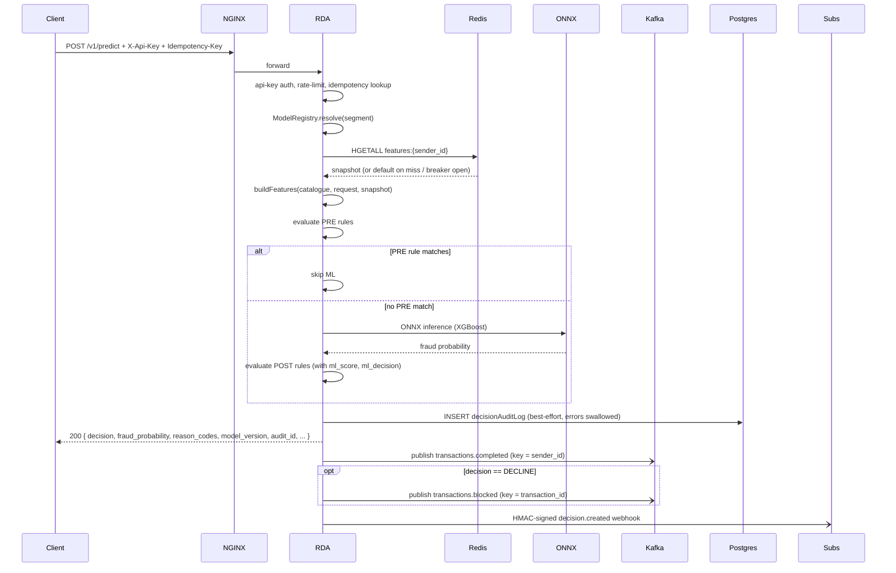
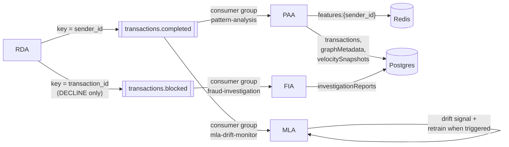
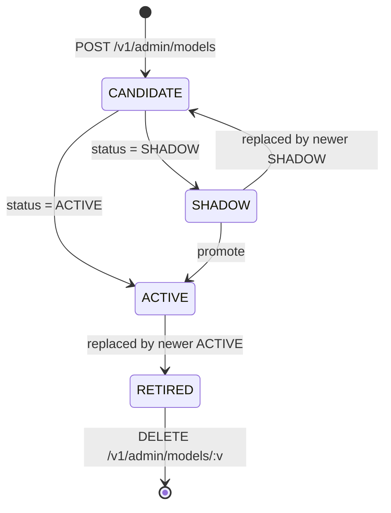
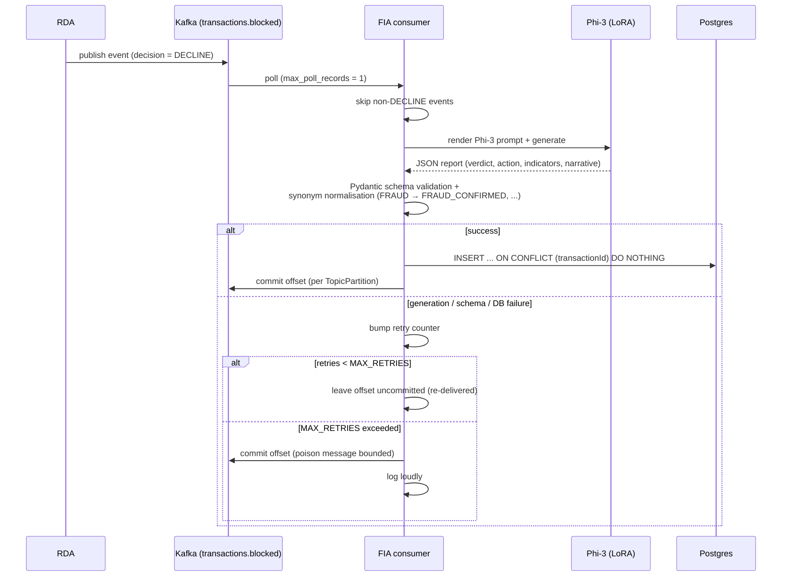

# Architecture

Ojuri is a self-hosted multi-agent fraud detection platform. This document is
the technical reference: it describes how the four backend agents and the
Sentinel operator dashboard cooperate, what each one is responsible for, how
data flows between them, and where the platform's failure modes are. Per-feature
contracts (auth, rules, model registry, features, audit, reason codes,
webhooks, idempotency, FIA HTTP API, frontend) live in their own documents
under `docs/` and are linked from each section rather than restated here.

## 1. Overview

The platform is a polyglot monorepo of **four backend services plus a frontend
SPA** that share PostgreSQL, Redis, and Apache Kafka. The split is deliberate:
the synchronous fraud-decision path runs in **RDA** (TypeScript / Fastify) so
that the millisecond-scale authorization budget is never spent on graph
analysis or LLM inference, while the heavier asynchronous work runs in
**PAA** (TypeScript Kafka worker), **MLA** (Python drift + retraining), and
**FIA** (Python LLM investigations). The Sentinel operator dashboard
(React + Vite) issues admin reads and rare writes; it never sits on the
prediction hot path.

`fraud_db` is a single Postgres database owned by RDA's Knex migrations under
`src/database/migrations/`. PAA, MLA, and FIA read and write the same tables
but do not own migrations — schema changes go through the root.

## 2. System diagram

Postgres in Docker is exposed on host port **5433** (container 5432) and Redis
on **6380** (container 6379) to avoid clashes with locally-installed servers.
Kafka topics are partitioned by **`sender_id`** for `transactions.completed`
(per-user ordering for PAA's graph + velocity updates) and by
**`transaction_id`** for `transactions.blocked` (so a single attacking sender
does not pin all of FIA's work to one partition).

## 3. Design principles

1. **RDA is the only service on the authorization hot path.** Every other
   agent is async-only. If PAA, MLA, FIA, or Sentinel is down, predictions
   continue to succeed.
2. **Async fan-out via Kafka with dual-topic separation.** RDA always
   publishes to `transactions.completed`; on `DECLINE` it additionally
   publishes the same event to `transactions.blocked`. The second topic
   exists so FIA's seconds-per-call LLM workload cannot share a queue with
   PAA's millisecond pipeline.
3. **Graceful degradation, not failure.** Redis and ONNX inference both
   sit behind `opossum` circuit breakers. Redis lookup falls back to a
   population-default feature snapshot (predictions continue with degraded
   accuracy); ONNX inference fails closed (probability 1.0 → DECLINE) so a
   model-runtime crash blocks rather than approves transactions.
4. **Filesystem model registry with hot-swap.** Trained models land in
   `models/versions/<v>/` via a bind-mount shared between MLA (writer) and
   RDA (reader). `ModelRegistryService` emits `onActiveChange`;
   `OnnxService` subscribes and atomically replaces the in-process session
   — no RDA restart.
5. **Audit log as the source of truth.** Every `/v1/predict` writes one
   row to `decisionAuditLog` with model versions, scores, threshold, rules
   that fired, reason codes, feature snapshot, and reviewer fields.
   Reviewer overrides populate `transactions.groundTruthFraud`, which
   MLA's training query prefers via `COALESCE` — the platform learns from
   verified human decisions, not from its own past output.
6. **Catalogue-driven feature contract.** A single
   `models/feature-catalog.v1.json` (+ optional adopter overlay) defines
   the ONNX input tensor. Every model bakes its `feature_schema_version`
   into `meta.json`; RDA refuses to load a model whose schema doesn't
   match the running catalogue. See [`FEATURES.md`](FEATURES.md).

## 4. Per-service architecture

### 4.1 RDA — Real-Time Detection Agent

**Responsibility.** Synchronous fraud decision at transaction time. RDA owns
the `/v1/predict` API, the entire authorization pipeline, and the
admin / auth / rules / model-registry / audit / webhooks / idempotency
surface area used by the operator dashboard. It is also the only producer
on Kafka.

**Stack.** TypeScript / Fastify / `tsyringe` DI / ONNX Runtime. Located at
the repository root under `src/`. Migrations under
`src/database/migrations/`.

**Predict pipeline** (`src/v1/modules/rda/services/predict.service.ts`):

1. Resolve `(championVersion, shadowVersion, threshold)` from
   `ModelRegistryService` for the request's `segment`.
2. Pull the raw Redis snapshot via `FeatureService` (circuit-broken).
3. Build a catalogue-aligned `Float32Array` via `buildFeatures(...)`.
4. Evaluate **PRE-stage rules**. A matching `ALLOW` / `DENY` / `REVIEW`
   short-circuits the pipeline; the ML model is not called.
5. Run ONNX inference (circuit-broken, fail-closed at probability 1.0).
6. Compute reason codes from feature deviations.
7. Evaluate **POST-stage rules** against the ML score and the feature
   snapshot. A match overrides the ML decision.
8. Write one row to `decisionAuditLog` (errors swallowed — audit failures
   never break the decision path).
9. Publish fire-and-forget to Kafka: always `transactions.completed`,
   additionally `transactions.blocked` when the final decision is
   `DECLINE`.
10. Publish the `decision.created` webhook fire-and-forget.
11. Return the response with `decision`, `fraud_probability`,
    `reason_codes`, `model_version`, `threshold`, and `audit_id`.

**Decision shape.** `decision` is one of `ACCEPT`, `DECLINE`, or `REVIEW`.
The ML model only produces `ACCEPT` or `DECLINE`; the `REVIEW` outcome can
only originate from a rule whose action is `REVIEW`.

**Failure mode.** RDA going down is the only failure that affects
authorization. Multiple replicas behind NGINX provide horizontal redundancy.

**Per-feature references.** [`AUTH.md`](AUTH.md), [`AUTHZ.md`](AUTHZ.md),
[`RULES.md`](RULES.md), [`MODEL-REGISTRY.md`](MODEL-REGISTRY.md),
[`FEATURES.md`](FEATURES.md), [`AUDIT.md`](AUDIT.md),
[`REASON-CODES.md`](REASON-CODES.md), [`WEBHOOKS.md`](WEBHOOKS.md),
[`IDEMPOTENCY.md`](IDEMPOTENCY.md).

### 4.2 PAA — Pattern Analysis Agent

**Responsibility.** Asynchronous feature computation. PAA consumes every
completed transaction, maintains a directed transaction graph and per-sender
velocity windows in memory, and writes the resulting features back to Redis
so the **next** RDA prediction sees fresh signals.

**Stack.** TypeScript Kafka consumer (KafkaJS). Located under
`paa-service/`. Not a Fastify app; the worker is `paa-service/src/worker.ts`
with a standalone `http.Server` exposing `/livez`, `/readyz`, `/metrics`,
`/stats` on `METRICS_PORT` (default 9090). PAA has its own `package.json`,
`tsconfig.json`, and DI aliases — the root `npm install` does not install
PAA dependencies.

**Inputs.** Subscribes to `transactions.completed` under consumer group
`pattern-analysis`. Auto-commit is disabled; offsets advance per-partition
after processing.

**Outputs.**
- Redis hash `features:{senderId}` — overwritten with the latest
  catalogue-keyed velocity + graph features.
- Postgres `transactions` (per-event row), `graphMetadata` (persisted every
  100 events — `processedCount % 100`), `velocitySnapshots`.

**Computed features.** Velocity over 1m / 5m / 15m / 1h / 24h / 7d / 30d
windows; amount mean and standard deviation; graph PageRank, clustering
coefficient, in-/out-degree, community membership, hub indicator.
PageRank is O(V·E) and is recomputed on a configurable interval
(`GRAPH_UPDATE_INTERVAL`, default 5 min) rather than per-event.

**Failure mode.** If PAA is down, Redis features grow stale and RDA's
`FeatureService` returns the population-default snapshot (logged as a
degraded-accuracy warning). The decision path continues.

### 4.3 MLA — Model Learning Agent

**Responsibility.** Offline drift detection, retraining, statistical
validation, ONNX export, and registration with RDA. MLA closes the
supervised-learning loop.

**Stack.** Python 3.11. Located under `mla-service/` with its own
`requirements.txt` and `venv`. The ONNX toolchain is pinned —
`onnx==1.13.0`, `onnxmltools==1.10.0`, `onnxconverter-common==1.12.0`
— because newer releases break XGBoost-to-ONNX conversion.

**Inputs.**
- Postgres `transactions` for training rows. The training query uses
  `COALESCE("groundTruthFraud", "fraudLabel")` and filters
  `("decisionSource" IS NULL OR "decisionSource" = 'ML')` so rule-driven
  DECLINEs do not leak into the training set as positives.
- Kafka `transactions.completed` for the drift-detection sliding window
  (consumer group separate from PAA's).

**Outputs.**
- `models/versions/<v>/{model.onnx, model.pkl, scaler.npz, meta.json}` on
  the shared bind-mount.
- `POST /v1/admin/models` then `POST /v1/admin/models/<v>/status {status:
  "ACTIVE"}` against RDA when `RDA_API_URL` + `MLA_SERVICE_TOKEN` are set.

**Drift triggers.** `DriftDetector` retrains when F1-score on recent
labelled data drops below `DRIFT_F1_THRESHOLD` (default 0.92) **or** PSI on
the `amount` feature exceeds `DRIFT_PSI_THRESHOLD` (default 0.25). PSI uses
10 histogram bins.

**Promotion gate.** `ModelValidator.ab_test()` runs McNemar's chi-squared
test with continuity correction against the currently deployed model. The
candidate is deployed only if F1 improves by at least `min_improvement`
(default 0.01) and the change is statistically significant at α = 0.05
(with a small-sample fallback path for when `b + c < 10` disagreements
leave McNemar with no power).

**Failure mode.** If MLA is down, no new models are trained or activated;
the currently ACTIVE model keeps serving. If MLA cannot reach RDA after a
successful training run, the version is still written to disk and an
operator can activate it manually from the admin UI.

**Per-feature reference.** [`TRAINING.md`](TRAINING.md),
[`MODEL-REGISTRY.md`](MODEL-REGISTRY.md), and the service-level README at
[`mla-service/README.md`](../mla-service/README.md).

### 4.4 FIA — Fraud Investigation Agent

**Responsibility.** Generate analyst-readable investigation reports for
declined transactions using a fine-tuned LLM, and answer conversational
follow-ups on those reports. **Strictly async** — FIA is never on the RDA
authorization path.

**Stack.** Python 3.11, HuggingFace Transformers + PyTorch, default model
`microsoft/Phi-3-mini-4k-instruct` (3.8B params). Located under
`fia-service/`. The first run downloads ~7.6 GB of weights to the
`fia-hf-cache` volume. Device selection is `LLM_DEVICE=auto`
(CUDA → MPS → CPU).

**Inputs.**
- Kafka `transactions.blocked` under consumer group `fraud-investigation`,
  keyed by `transaction_id`. Consumer is configured with
  `max_poll_records=1` and `max_poll_interval_ms=600000` (10 min) so a
  slow LLM generation does not trigger a partition rebalance.
- HTTP — `POST /v1/reports` for on-demand reports on any transaction (not
  just blocked ones), `POST /v1/reports/{id}/messages` for conversational
  follow-ups.

**Outputs.**
- Postgres `investigationReports` (`UNIQUE` on `transactionId`; writer uses
  `INSERT ... ON CONFLICT DO NOTHING` for idempotency).
- Postgres `investigationConversations` for follow-up turns.

**Resilience.** An in-memory retry counter caps redelivery at
`MAX_RETRIES = 3`; after that the offset is committed and the failure is
logged loudly so a poison message cannot wedge a partition. A
deterministic `_rule_based_report()` fallback runs when `transformers` /
`torch` are missing, the model fails to load, or generated JSON fails
schema validation. Fallback rows are tagged with `-fallback` on
`llmModelVersion`. Toggle via `FIA_FALLBACK_ON_LLM_FAILURE` (default
`true`).

**Failure mode.** If FIA is down, blocked transactions queue up on
`transactions.blocked`; when FIA reconnects it catches up. RDA decisions
are unaffected.

**Per-feature reference.** [`FIA-API.md`](FIA-API.md), and the
service-level README at [`fia-service/README.md`](../fia-service/README.md).

### 4.5 Sentinel — operator dashboard

**Responsibility.** Operator UI for reviewing decisions, overriding
decisions, editing rules, registering and promoting models, browsing the
audit log, and triggering or reading FIA investigations.

**Stack.** Vite + React 18 SPA under `frontend/`. Tests run on Vitest in
jsdom. The dashboard has its own `package.json` and `node_modules`; the
root `npm install` does not install frontend dependencies.

**Inputs / outputs.** Reads from RDA `/v1/admin/*` (admin-gated by JWT)
and FIA `/v1/reports*`. Writes are limited to operator actions: issue API
key, save rule, register model, set model status, subscribe webhook,
override a decision, request an investigation report, post a follow-up
message. The dashboard never sits on the prediction hot path.

**Offline behaviour.** Every read in `frontend/src/api/client.js` is
wrapped in `safe(live, fallback)`, where `fallback` is always an empty
value (`[]`, `{ rows: [], total: 0 }`, `null`). When backends are
unreachable the dashboard shows empty states and a persistent
`OFFLINE` banner (`frontend/src/app.jsx`); it never displays synthetic
data. Write calls (issue key, save rule, …) do not use `safe`; they
try the real call, catch failures locally, surface a toast, and leave
the form in its previous state so the operator can retry. The previous
`mock.js` seed dataset and the `sentinel.useMock` localStorage override
were removed in May 2026 — adopters were confused by fake credentials
and fraud rows showing up on Integrations / Review queue when the
backend was just unreachable.

**Failure mode.** None on the decision path. If the dashboard is down,
the platform continues to score transactions; operators lose their
review queue and admin surface.

**Per-feature reference.** [`FRONTEND.md`](FRONTEND.md), and the
service-level README at [`frontend/README.md`](../frontend/README.md).

## 5. Data flows

### 5.1 Prediction request

The Kafka publishes and the webhook delivery are fire-and-forget — they
never delay the HTTP response. When Kafka is unreachable, the producer
buffers each entry on local disk as `{ v: 2, topic, partitionKey, event }`
(LevelDB); on reconnect, `flushBuffer` replays each buffered entry to the
**original topic** with the **original partition key**.

### 5.2 Async fan-out

The dual-topic split is **the** mechanism that lets FIA run at LLM latency
(40–90 s/report on Apple MPS) without ever back-pressuring PAA (millisecond
graph + velocity updates). Both consumer groups can scale independently —
PAA runs two replicas in the reference Compose, FIA runs one (single PyTorch
session).

### 5.3 Model promotion + hot-swap

End-to-end:

1. MLA writes `models/versions/<v>/` to the shared bind-mount.
2. MLA POSTs `/v1/admin/models` with `{version, sourceUri, sha256,
   defaultThreshold, metrics}`. The row lands as `CANDIDATE`.
3. MLA POSTs `/v1/admin/models/<v>/status {status: "ACTIVE"}` — the
   currently ACTIVE row is moved to RETIRED with `retiredAt` stamped; the
   new row is set to ACTIVE with `activatedAt` stamped.
4. Within `MODEL_REGISTRY_REFRESH_MS` (default 30 s), every RDA replica
   re-reads `modelVersions` into its in-memory cache.
5. `ModelRegistryService.onActiveChange` fires.
6. `OnnxService.applyActiveVersion` reads the schema version from the new
   row's `metadata`, compares to the running catalogue's `schemaVersion`,
   and **refuses to load** on mismatch (the previous session keeps
   serving; the failure is logged at ERROR level).
7. On match, `OnnxService` resolves the `sourceUri` to a local path,
   copies the bytes into `MODEL_PATH` via an atomic rename, and reloads
   the session. No RDA restart.

See [`MODEL-REGISTRY.md`](MODEL-REGISTRY.md) for endpoints, segment
thresholds, and shadow scoring details.

### 5.4 Override-as-label retraining loop

This is how the platform learns from verified human decisions rather than
from its own past output:

1. An analyst opens the review queue in Sentinel and overrides a decision
   (`POST /v1/decisions/:auditId/override` with `{decision, reviewer,
   reason}`).
2. `DecisionAuditService.override` updates the audit row's
   `overrideDecision`, `overrideReason`, `reviewedBy`, `reviewedAt`.
3. The same call writes `transactions.groundTruthFraud` (true on
   `DECLINE`, false on `ACCEPT`) along with `groundTruthSource =
   'reviewer_override'` and `groundTruthRecordedBy`. The write is
   best-effort; a missing transactions row (PAA hadn't flushed yet) is
   logged but does not fail the override.
4. The `decision.overridden` webhook fires.
5. MLA's next training query selects
   `COALESCE("groundTruthFraud", "fraudLabel")` ordered by
   `"groundTruthFraud" IS NOT NULL DESC, "createdAt" DESC` — verified
   labels always win over the system's prior decisions.
6. The next ACTIVE model has learnt from the reviewer's verdict instead
   of mimicking the rule or the old model that produced it.

The migration that introduced `groundTruthFraud` plus its companion
provenance columns and the partial index is
`src/database/migrations/20260514000002_add_ground_truth_to_transactions.ts`.

### 5.5 Investigation generation

On-demand reports follow the same Phi-3 → schema-validation →
`INSERT ... ON CONFLICT` pipeline via `POST /v1/reports`. Follow-up
turns hit `POST /v1/reports/{id}/messages` and are persisted in
`investigationConversations` with a stable `turnIndex`; the conversation
state is loaded back into the prompt for grounding. See
[`FIA-API.md`](FIA-API.md) for the wire contract.

## 6. Deployment topology

The shipped `docker-compose.yml` runs the reference production stack:

- **NGINX** on host port 80 in front of three RDA replicas (`rda-1`,
  `rda-2`, `rda-3`), each capped at 1 CPU / 4 GB.
- **Two PAA replicas** (`paa-1`, `paa-2`) under consumer group
  `pattern-analysis`, each capped at 2 CPU / 8 GB. Metrics on host ports
  9091 / 9092.
- **One FIA** instance gated behind the `fia` Compose profile (opt in with
  `docker compose --profile fia up -d fia`). The gate exists because the
  Phi-3 weights are ~7.6 GB and the `torch`/`transformers`/`accelerate`
  image is heavy; first-time adopters should not pay that cost before
  seeing the rest of the stack run. FIA listens on host port 9094 and is
  capped at 16 GB / 2 CPU.
- **MLA** is not in `docker-compose.yml` by default — it runs from its
  own venv on the host, on `METRICS_PORT` 9095. The RDA service-health
  fan-out includes `MLA_HEALTH_URL=http://host.docker.internal:9095` for
  this reason.
- **Sentinel** is served separately (Vite dev server on 5173, or a
  static build behind your own reverse proxy in production). It is not
  bundled into compose.
- **Infra**: Redis (host 6380), Kafka + Zookeeper (host 9092 external,
  29092 internal — the internal listener is what containers use to avoid
  the `localhost:9092` self-loop), Postgres (host 5433), Prometheus
  (host 9090), Grafana (host 3001).

The Kafka broker is configured with `KAFKA_NUM_PARTITIONS=12` and 7-day
log retention by default; tune for your throughput before going live.

The `models/` directory at the repository root is bind-mounted **read-only**
into every RDA container and **read-write** into the MLA process so model
versions written by MLA appear immediately to RDA. The compose file also
sets `extra_hosts: host.docker.internal:host-gateway` on RDA replicas so
the MLA health probe works on Linux hosts (macOS Docker Desktop provides
the alias implicitly).

For development with hot-reload, `docker-compose.dev.yml` overlays
`rda-dev` and `paa-dev` services that mount the source tree and run
through nodemon.

## 7. Resilience and failure modes

| Trigger | System response | Observable signal | Recovery |
|---|---|---|---|
| Redis down or slow | `FeatureService` circuit breaker opens; predict path uses `DEFAULT_REDIS_SNAPSHOT`. Predictions continue with degraded accuracy. | `redis-features` breaker state gauge; `featuresDefault = true` rows in `decisionAuditLog`. | Restart Redis; breaker closes automatically on a successful probe. |
| ONNX inference failure | Circuit breaker fallback returns probability 1.0 → DECLINE. Fail-closed. | `onnx-predict` breaker state gauge; ONNX error logs from `onnx.service.ts` line ~46. | Investigate the model file (corrupt? schema mismatch?). Roll back to a known-good version via the registry. |
| Schema-version mismatch on model activation | `OnnxService.applyActiveVersion` refuses to load; previous session keeps serving traffic. | RDA ERROR log `Refusing to load model — feature schema mismatch` with reported vs expected versions. | Either retrain against the current catalogue or revert the adopter overlay. |
| Kafka unreachable | `publishAsync` retries then buffers each entry to LevelDB as `{ v: 2, topic, partitionKey, event }`. Predictions succeed; PAA / MLA / FIA lag. | RDA WARN logs from `kafka-producer.ts`; PAA / FIA / MLA readiness drops. | On reconnect, `flushBuffer` replays buffered entries to their original topic + partition key. |
| PAA down | Redis features grow stale; `FeatureService` continues to serve whatever is in Redis (or default on miss). | PAA `/readyz` 503; `paa_kafka_lag` grows. | Restart PAA; it consumes from the last committed offset and Redis catches up. |
| MLA down | No drift detection, no retraining, no automatic promotion. ACTIVE model continues to serve. | MLA `/livez` unreachable; no new rows in `modelVersions`. | Restart MLA. Manual training via `python -m src.main --train` is also available. |
| FIA LLM load failure | With `FIA_FALLBACK_ON_LLM_FAILURE=true` (default), a deterministic rule-based report is produced; `llmModelVersion` ends in `-fallback`. With `false`, the consumer surfaces 500s and a poison-counter bounds retry. | `llm_model` reported on `/stats`; fallback-tagged rows in `investigationReports`. | Fix the device / weights / dependencies, restart FIA. |
| Postgres down | Audit log writes fail (swallowed — predictions continue); idempotency cache writes fail (predictions still succeed, but a retry within TTL will not replay). `readyz` probes flip to 503. | Liveness up, readiness down on RDA / PAA / FIA. | LB removes the replica; restart Postgres. The audit log is best-effort — rows during the outage are lost. If regulatory zero-loss audit is required, journal through Kafka. |
| Poison message on `transactions.blocked` | FIA in-memory retry counter caps redelivery at `MAX_RETRIES = 3`, then commits the offset and logs loudly. | `/stats` `dropped_poison` increments. | Inspect the message in the Kafka offset; fix the producer side if there's a schema bug. |

The two layers of circuit breakers in RDA (`redis-features` and
`onnx-predict`) intentionally have asymmetric fallback policies. Redis
fallback **continues** the prediction with degraded features because the
worst case is a slightly less accurate decision. ONNX fallback **declines**
because the worst case of approving on a broken model is unbounded fraud
loss. See `src/shared/circuit-breaker/` for the breaker primitives and
`src/v1/modules/rda/services/feature.service.ts` + `src/shared/onnx/onnx.service.ts`
for the policies.

## 8. Performance characteristics

The numbers below were measured on a single Apple Silicon developer
workstation with the infra in Docker on the same host. They are
orientation values, not SLA targets — re-measure on your own hardware
before relying on them.

| Path | Metric | Value |
|---|---|---|
| ONNX inference, batch = 1 (CPUExecutionProvider) | p50 / p99 | 0.010 ms / 0.049 ms |
| ONNX inference, batch = 128 | throughput | ~1.18 M predictions/s |
| RDA `POST /v1/predict`, single client (3,000 trials) | p50 / p99 / mean | 1.24 ms / 4.06 ms / 1.36 ms |
| RDA throughput at peak (16 concurrent connections) | req/s | ~3,146 |
| RDA at saturation (64 concurrent connections) | p99 / req/s | 297 ms / ~1,832 |
| MLA retrain on IEEE-CIS (683,852 train + 5-fold CV + SMOTE) | wall time | 27.67 s |
| Deployed IEEE-CIS XGBoost on held-out test (118,108 rows) | F1 / AUC-ROC / Precision / Recall | 0.554 / 0.911 / 0.841 / 0.414 |
| Phi-3-mini load on Apple MPS, fp16 | wall time | ~46 s |
| Phi-3-mini first generation (one-time MPS kernel compile) | wall time | ~6–10 min |
| Phi-3-mini steady-state generation | wall time | ~40–90 s/report |

Two artefacts ship in `models/` and have very different signals.
`models/fraud_model.onnx` is the legacy PaySim-trained model — its F1 ≈
0.999 numbers are inflated by balance-delta label leakage and should not
be cited as platform performance. `mla-service/models/fraud_model_v1.0.onnx`
is the IEEE-CIS-trained candidate referenced in the table above; the
F1 / AUC there is the honest signal.

## 9. Cross-references

### Per-feature docs

- [`AUTH.md`](AUTH.md) — API-key issuance, verification, rate limit, rotation
- [`AUTHZ.md`](AUTHZ.md) — user login, JWT sessions, roles, permission catalogue
- [`RULES.md`](RULES.md) — JSON-Logic-style DSL, PRE / POST stages, hot reload
- [`MODEL-REGISTRY.md`](MODEL-REGISTRY.md) — CANDIDATE → SHADOW → ACTIVE → RETIRED lifecycle, per-segment thresholds
- [`FEATURES.md`](FEATURES.md) — 64-feature base catalogue, adopter overlay, compute ops, schema versioning
- [`TRAINING.md`](TRAINING.md) — operator runbook for training, validation, promotion
- [`AUDIT.md`](AUDIT.md) — `decisionAuditLog` schema, SQL recipes, overrides, retention
- [`REASON-CODES.md`](REASON-CODES.md) — inline per-decision explanations: catalogue, math, localisation
- [`WEBHOOKS.md`](WEBHOOKS.md) — events, payload schemas, HMAC verification, retry ledger
- [`IDEMPOTENCY.md`](IDEMPOTENCY.md) — `Idempotency-Key` semantics, scoping, TTL, conflict handling
- [`FIA-API.md`](FIA-API.md) — on-demand reports, conversational follow-ups, latency expectations
- [`FRONTEND.md`](FRONTEND.md) — Sentinel layout, auth, offline / demo mode, extending it

### Service-level READMEs

- [`paa-service/`](../paa-service/) — no README yet; consult `paa-service/src/worker.ts` for the entry point
- [`mla-service/README.md`](../mla-service/README.md)
- [`fia-service/README.md`](../fia-service/README.md)
- [`frontend/README.md`](../frontend/README.md)

### Roadmap and history

- [`ROADMAP.md`](../ROADMAP.md) — what's planned next (Helm / Terraform,
  client SDKs, canary by API-key cohort, PII tokenisation, mTLS,
  OAuth 2.0 client-credentials, pre-built connectors, demo dataset,
  hosted sandbox) and what's deliberately out of scope.
- [`CHANGELOG.md`](../CHANGELOG.md) — per-release history.
